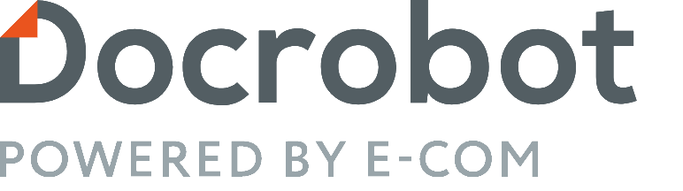
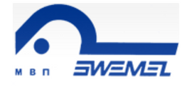
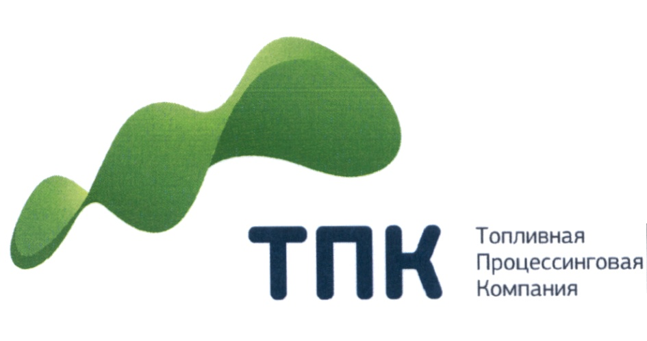
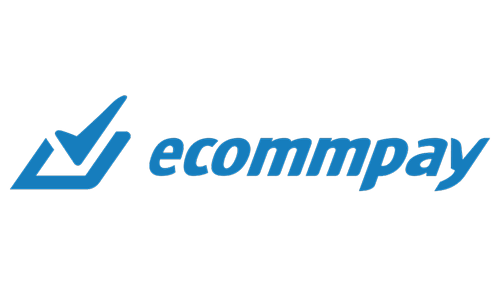
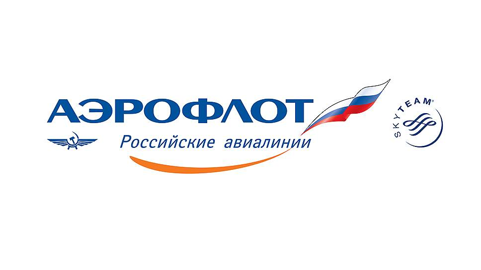

<h1 align="center">Всем привет! Меня зовут Костя</h1>
<h3 align="center">QA Manger</h3>

### Образование

<table width="100%" border='0'>
   <tr> 
    <td width="30%" valign="bottom"></td><td valign="middle">PositiveTechnologies. Zero Security:A. Pentestit. 2014 Информационная безопасность.</td></tr>
    <tr><td width="30%" valign="bottom"></td><td valign="middle">Лаборатория качества. Школа Тест-Менеджеров. 2014 <a target="_blank" href="https://qaschool.ru/students/k_russkih/">Certificate</a>  Тест-менеджер.</td></tr>
    <tr><td width="30%" valign="bottom"></td><td valign="middle">Программирование на Java для тестировщиков. 2019 <a target="_blank" href="http://cert.software-testing.ru/256377591326310912">Certificate</a>.</td></tr>
    <tr><td width="30%" valign="bottom"></td><td valign="middle">Лаборатория качества. Аудит и опримизация QA-процессов. 2020 <a target="_blank" href="https://qaschool.ru/students/k_russkih/">Certificate</a>  Тест-менеджер.</td>
    <tr><td width="30%" valign="bottom"></td><td valign="middle">Школа инженеров по автоматизации тестирования. 2023 <a target="_blank" href="https://qa.guru">qa.guru</a>.</td></tr>
   </tr>
  </table>
   

### Работа

 <table style="width=100%" cellspacing="0" cellpadding="5">
<tr>
        <td align="center">
            
        </td>
        <td>
            Магнит
          <b>Начальник отдела тестирования.</b>
        </td>
        <td>Июль 2021 — март 2023</td>
        <td>Запуск мобильных приложений: Магнит доставка, сборщик, курьер. Участие в приемочном тестировании. 
            Запуск сайта Магнит доставка. Поддержка и развитие сайта Магнит Аптека. 
            Построение процесса тестирования внутри отдела и взаимодействие с подрядчиками. Команда 40+ человек. 
            Внедрение автоматизации и тестирования производительности.
            Написание регламентов, инструкций. 
            Онбординг новых сотрудников. 
            Проработка стратегии тестирования исходя из требований бизнеса. 
            Выбор и внедрение инструментов тестирования.</td>
    </tr>
<tr>
        <td align="center">
            
        </td>
        <td>
            Docrobot
          <b>QA Manager</b>
        </td>
        <td>Апрель 2019 — июль 2021</td>
        <td>Управление командой тестирования, состоящей из 16 человек.
            Участие в построении и организации работы отдела тестирования на 4-х проектах.
            Создание отдела тестирования с нуля.
            Выстраивание работы и взаимодействия с удаленной командой тестирования. 
            Анализ существующих процессов на выявление узких мест. 
            Проведение собеседований и обучение новых сотрудников. 
            Развитие автоматизации на проектах.
            Внедрение тестирования производительности.</td>
    </tr>
<tr>
        <td align="center">
            
        </td>
        <td>
            Swemel
          <b>Test-Lead.</b>
        </td>
        <td>Май 2018 — июнь 2020</td>
        <td>Построение процесса тестирования с нуля;
            Load-test (Jmeter);
            Написание автотестов (Java, Maven, JUnit);</td>
    </tr>
        <tr>
        <td align="center">
            
        </td>
        <td>
            Storiqa
          <b>Test-Lead.</b>
        </td>
        <td>Ноябрь 2018 - март 2019</td>
        <td>1. Анализ существующих процессов тестирования и внедрение практик по их улучшению.
            2. Ручное тестирование web сайта.
            3. Ручное тестирование мобильного приложения (iOS, Android).
            4. Автоматизация тестирования (Selenium WD, JUnit4).
            5. Составление тестовой документации.
            6. Внедрение TestRail.
            7. Тестирование безопасности (Kali Linux).</td>
    </tr>
        <tr>
        <td align="center">
            
        </td>
        <td>
            АО ТПК
          <b>QA manager.</b>
        </td>
        <td>Август 2016 - август 2018</td>
        <td>1. Создание отдела обеспечения качества.
            2. Организация процесса тестирования.
            3. Написание тест-плана, тест-анализа, чек-листов и тест-кейсов.
            4. Внедрение ручного тестирования.
            5. Внедрение автоматизированного тестирования.
            6. Тестирование безопасности.
            7. Внедрение и администрирование JIRA.
            8. Внедрение TestRail.
            9. Ручное тестирование.
            10. Автоматизированное тестирование (Selenium WD + PHP).
            11. Помощь в написании ПМИ, ТЗ, ФТ. 
            12. Участие в разработке требований для новых доработок, улучшении существующего функционала.
            13. Тестирование документации.
            14. Тестирование мобильных приложений под iOS и Android.
            15. Тестирование топливного процессинга (WAY4).
            16.Тестирование API при помощи SOAP UI.
            17. Автоматизация тестирования при помощи SOAP UI.
            18. Разработка архитектуры тестового стенда.</td>
    </tr>
    <tr>
        <td align="center">
            
        </td>
        <td>
            Paymantix
          <b>Test-Lead.</b>
        </td>
        <td>Сентябрь 2016 - июнь 2017</td>
        <td>Организация тестирования финансовой системы;
            тестирование финансовой системы;
            тестирование процессинга (Decta);
            Vagrant, GIT, Ubuntu, SoapUI, Jira, Confluence, zephyr, testrail, jenkins;
            написание тестовой документации (test-case, check-list, test plan);
            тестирование юзабилити;
            тестирование безопасности (Kali Linux);
            тестирование сверок;
            функциональное тестирование;
            участие в согласовании требований к новым интеграциям;
            помощь в подготовке к pci dss.</td>
    </tr>
        <tr>
        <td align="center">
            
        </td>
        <td>
            ПАО Аэрофлот
          <b>Test-Lead.</b>
        </td>
        <td>Июнь 2014 - август 2016</td>
        <td>Оптимизация процессов тестирования корпоративных продуктов.
            Разработка стратегии тестирования.
            Оптимизация рисков.
            Администрирование Jira.
            Ведение процессов тестирования в jira.
            Проведение тестирования производительности при помощи HP LoadRunner.
            Разработка сценариев тестирования производительности.
            Сбор требований бизнеса.
            Документирование бизнес-процессов.
            Составление ТЗ, ФТ, РИ, ПМИ.
            Общение с разработчиками. 
            Постановка задач разработчикам.
            Контроль сроков выполнения задач.
            Внедрение ПО.
            Составление отчётов по текущему состоянию проектов.
            Сбор метрик.</td>
    </tr>
        <tr>
        <td align="center">
            
        </td>
        <td>
            CDCOM
          <b>Test-Lead.</b>
        </td>
        <td>Ноябрь 2013 - июнь 2014</td>
        <td>Организация процесса тестирования с нуля;
            написание тестовой документации: test-plan, test design, test analysis, check list, test-case;
            выявление проектных рисков;
            оценка трудозатрат;
            подбор персонала;
            ручное тестирование ПО, составление отчетов по результатам тестирования;
            взаимодействие с группой разработчиков;
            тестирование билдов после каждого релиза;
            smoke, functional, usability, regression, exploratory ,sanity, load, build verification, stress testing;
            тестирование методом Black-box;
            тестирование по test-case;
            разбиение на классы эквивалентности (по спецификации и требованиям);
            автоматизация процесса Sikuli, SeleniumIDE, SeleniumWEBDriver+PHP (framework facebook);
            load testing при помощи JMeter и Яндекс.Танк;
            тестирование приложений для Smart TV;
            тестирование Biling;
            есть небольшой опыт работы с Bitbucket, Git;
            осуществление тестирования на разных операционных системах и в разных конфигурациях (операционные системы: MacOS, Win. Eclipse, xCode, VirtualBox, AndroidSDK, MonkeyTalk);
            тестирование безопасности, путём нахождения слабых мест для XSS-атак, SQL Injection;
            тестирование путём Black-box;
            есть теоретическое понимание ГОСТ 19 и ГОСТ 34. (На практике применялись мало);
            составление метрик для оценки: качества продукта, качества тестирования, эффективности тестирования;
            тестирование десктопных, нативных и гибридных приложений на iOS и Android.
            опыт администрирования JIRA. Confluence;
            использование для тестирования VMware;
            управление командой из 2 человек</td>
    </tr>
            <tr>
        <td align="center">
            
        </td>
        <td>
            Актион-медиа
          <b>Инженер по тестированию.</b>
        </td>
        <td>июль 2013 - октябрь 2013</td>
        <td>Тестирование программы по бухгалтерскому учету;
            взаимодействие с группой разработчиков;
            выявление багов;
            тестирование билдов после каждого релиза;
            тестирование по test-case;
            smoke, functional, usability, regression, sanity, build verification testing;
            баг-трекинговая система Jira+Confluence;
            automatization testing SeleniumIDE, SeleniumRС+PHP</td>
    </tr>
        <tr>
        <td align="center">
            
        </td>
        <td>
            My-Apps
          <b>Инженер по тестированию.</b>
        </td>
        <td>январь 2013 - июнь 2013</td>
        <td>Ручное тестирование сайта и мобильных приложений компании;
            составление отчетов;
            консолидация результатов;
            взаимодействие с группой разработчиков;
            составление test-case;
            составление отчета о работе;
            осуществление тестирования на разных операционных системах и в разных конфигурациях (операционные системы: MacOS, Win. Eclipse, xCode, VirtualBox, AndroidSDK, MonkeyTalk);
            тестирование билдов после каждого релиза;
            тестирование по тест-сценариям (test-case); 
            автоматизация процесса с помощью sikuli;
            smoke, regression, functional, build verification test;
            automatization testing Selenium IDE, Sikuli.</td>
    </tr>
    	<tr>
        <td align="center">
            
        </td>
        <td>
            Акадо ("Акадо")
          <b>Инженер по тестированию.</b>
        </td>
        <td>ноябрь 2011 -  январь 2013</td>
        <td>Ручное тестирование сайта компании;
            составление отчетов;
            консолидация результатов;
            взаимодействие с группой разработчиков;
            составление test-case;
            выявление багов;
            составление отчета о работе;
            тестирование билдов после каждого релиза;
            тестирование по test-case; 
            usability, regression, integration testing;
            опыт работы с Jira, confluence;
            функциональное тестирование.</td>
        </tr>
</table>
