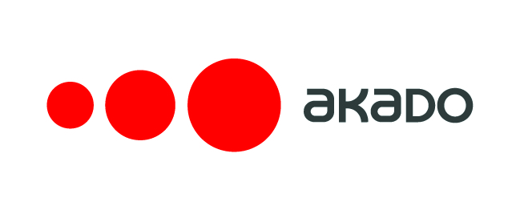
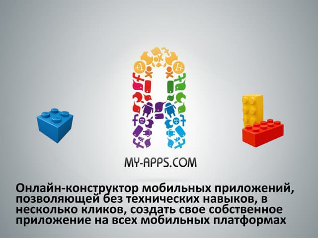
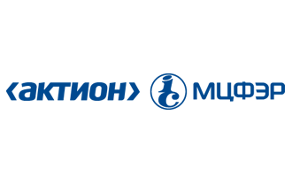

<h1 align="center">Всем привет! Меня зовут Костя</h1>
<h3 align="center">QA Manger</h3>

### Образование

<table width="100%" border='0'>
   <tr> 
    <td width="30%" valign="bottom"></td><td valign="middle">PositiveTechnologies. Zero Security:A. Pentestit. 2014 Информационная безопасность.</td></tr>
    <tr><td width="30%" valign="bottom"></td><td valign="middle">Лаборатория качества. Школа Тест-Менеджеров. 2014 <a target="_blank" href="https://qaschool.ru/students/k_russkih/">Certificate</a>  Тест-менеджер.</td></tr>
    <tr><td width="30%" valign="bottom"></td><td valign="middle">Программирование на Java для тестировщиков. 2019 <a target="_blank" href="http://cert.software-testing.ru/256377591326310912">Certificate</a>.</td></tr>
    <tr><td width="30%" valign="bottom"></td><td valign="middle">Лаборатория качества. Аудит и опримизация QA-процессов. 2020 <a target="_blank" href="https://qaschool.ru/students/k_russkih/">Certificate</a>  Тест-менеджер.</td>
    <tr><td width="30%" valign="bottom"></td><td valign="middle">Школа инженеров по автоматизации тестирования. 2023 <a target="_blank" href="https://qa.guru">qa.guru</a>.</td></tr>
   </tr>
  </table>
   

### Работа

 <table style="width=100%" cellspacing="0" cellpadding="5">
	<tr>
        <td align="center">
            
        </td>
        <td>
            Акадо ("Акадо")
          <b>Инженер по тестированию.</b>
        </td>
        <td>ноябрь 2011 -  январь 2013</td>
        <td>Ручное тестирование сайта компании;
            составление отчетов;
            консолидация результатов;
            взаимодействие с группой разработчиков;
            составление test-case;
            выявление багов;
            составление отчета о работе;
            тестирование билдов после каждого релиза;
            тестирование по test-case; 
            usability, regression, integration testing;
            опыт работы с Jira, confluence;
            функциональное тестирование.</td>
        </tr>
    <tr>
        <td align="center">
            
        </td>
        <td>
            My-Apps
          <b>Инженер по тестированию.</b>
        </td>
        <td>январь 2013 - июнь 2013</td>
        <td>Ручное тестирование сайта и мобильных приложений компании;
            составление отчетов;
            консолидация результатов;
            взаимодействие с группой разработчиков;
            составление test-case;
            составление отчета о работе;
            осуществление тестирования на разных операционных системах и в разных конфигурациях (операционные системы: MacOS, Win. Eclipse, xCode, VirtualBox, AndroidSDK, MonkeyTalk);
            тестирование билдов после каждого релиза;
            тестирование по тест-сценариям (test-case); 
            автоматизация процесса с помощью sikuli;
            smoke, regression, functional, build verification test;
            automatization testing Selenium IDE, Sikuli.</td>
    </tr>
    <tr>
        <td align="center">
            
        </td>
        <td>
            Актион-медиа
          <b>Инженер по тестированию.</b>
        </td>
        <td>июль 2013 - октябрь 2013</td>
        <td>Тестирование программы по бухгалтерскому учету;
            взаимодействие с группой разработчиков;
            выявление багов;
            тестирование билдов после каждого релиза;
            тестирование по test-case;
            smoke, functional, usability, regression, sanity, build verification testing;
            баг-трекинговая система Jira+Confluence;
            automatization testing SeleniumIDE, SeleniumRС+PHP</td>
    </tr>
    <tr>
        <td align="center">
            
        </td>
        <td>
            CDCOM
          <b>Test-Lead.</b>
        </td>
        <td>Ноябрь 2013 - июнь 2014</td>
        <td>Организация процесса тестирования с нуля;
            написание тестовой документации: test-plan, test design, test analysis, check list, test-case;
            выявление проектных рисков;
            оценка трудозатрат;
            подбор персонала;
            ручное тестирование ПО, составление отчетов по результатам тестирования;
            взаимодействие с группой разработчиков;
            тестирование билдов после каждого релиза;
            smoke, functional, usability, regression, exploratory ,sanity, load, build verification, stress testing;
            тестирование методом Black-box;
            тестирование по test-case;
            разбиение на классы эквивалентности (по спецификации и требованиям);
            автоматизация процесса Sikuli, SeleniumIDE, SeleniumWEBDriver+PHP (framework facebook);
            load testing при помощи JMeter и Яндекс.Танк;
            тестирование приложений для Smart TV;
            тестирование Biling;
            есть небольшой опыт работы с Bitbucket, Git;
            осуществление тестирования на разных операционных системах и в разных конфигурациях (операционные системы: MacOS, Win. Eclipse, xCode, VirtualBox, AndroidSDK, MonkeyTalk);
            тестирование безопасности, путём нахождения слабых мест для XSS-атак, SQL Injection;
            тестирование путём Black-box;
            есть теоретическое понимание ГОСТ 19 и ГОСТ 34. (На практике применялись мало);
            составление метрик для оценки: качества продукта, качества тестирования, эффективности тестирования;
            тестирование десктопных, нативных и гибридных приложений на iOS и Android.
            опыт администрирования JIRA. Confluence;
            использование для тестирования VMware;
            управление командой из 2 человек</td>
    </tr>
</table>