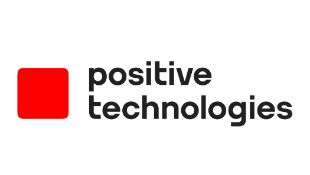

<h1 align="center">Всем привет! Меня зовут Костя</h1>
<h3 align="center">QA Manger</h3>

### Образование

<table width="100%" border='0'>
   <tr> 
    <td width="30%" valign="bottom"></td><td valign="middle">PositiveTechnologies. Zero Security:A. Pentestit. 2014 Информационная безопасность.</td></tr>
    <tr><td width="30%" valign="bottom"></td><td valign="middle">Лаборатория качества. Школа Тест-Менеджеров. 2014 <a target="_blank" href="https://qaschool.ru/students/k_russkih/">Certificate</a>  Тест-менеджер.</td></tr>
    <tr><td width="30%" valign="bottom"></td><td valign="middle">Программирование на Java для тестировщиков. 2019 <a target="_blank" href="http://cert.software-testing.ru/256377591326310912">Certificate</a>.</td></tr>
    <tr><td width="30%" valign="bottom"></td><td valign="middle">Лаборатория качества. Аудит и опримизация QA-процессов. 2020 <a target="_blank" href="https://qaschool.ru/students/k_russkih/">Certificate</a>  Тест-менеджер.</td>
    <tr><td width="30%" valign="bottom"></td><td valign="middle">Школа инженеров по автоматизации тестирования. 2023 <a target="_blank" href="https://qa.guru">qa.guru</a>.</td></tr>
   </tr>
  </table>
   

### Работа